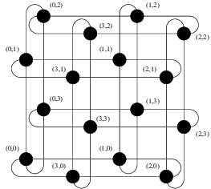

# Parallel Universal Cellular Automata - Parallel Systems Second Project

## Goal

The purpose of this project is to develop a distributed version of a universal cellular automata based on an iterative stencil loop, where each machine communicates using OpenMPI.

The project is done in C using the mpi.h library and displaying in either an SVG file or on screen depending on Makefile options (see Makefile).

## How to run

### Makefile

The Makefile contains the necessary commands for compilation, you just need to run ```make -B``` (the -B option is not needed if it is the first time, but it is recommended if you modify files such as the Makefile or ***settings.h***).

The Makefile contains 2 variables you can set :
- VERBOSE : define the level of prints you get from the program (precisions in makefile itself)
- DISPLAY_MODE : define how to render the cellular automata (precisions in makefile itself)

The Makefile also contains the command ```make run```, which launch the program with MPI using 8 processes. You can modify this command if you want of run the MPI application yourself with the command : 

```bash
 mpirun -np [number of processes]  --use-hwthread-cpus -x DISPLAY=:0 main
```

Or you can also change this command to give it a file for host machines, etc.

### Settings

The file ***settings.h*** is here to define constants used in the program, they can be changed if you want a bigger or smaller screen, or more iterations, etc. A description of each field is in the file itself.

## The code

The main file ***main.c*** is just here to call the necessary functions from the files in the ***src/*** folder. The structure of the files in ***src/*** are as follows :
- **grid** : Simple library made to create and manipulate binary grid objects.
- **cellular_grid** : Layer above *grid* to simulate the cellular automaton functionalities, with generations, convolution function, and also 'virtual walls' used for the communication later.
- **rendering** : Used to have 3 functions to create, iterate, and finish the rendering depending on the variable **DISPLAY_MODE** in the makefile.
- **automata** : Core of the computation, this is where the cellular automata is made from the other files, and communicate with each other using MPI. 

There are also some lesser files used for constants or structures used throughout the code :
- settings.h : constants used to define the rendering aspects (size of canvas, duration between generations, etc.)
- communication_utils.h : hold a structure used to hold a "communication schema", meaning the different variable used by each processes to represent the whole communication structure (it's own position, number of processes, how many columns and rows of processes, etc. )

## Rendering precisions 

### SVG

The SVG rendering was the first made in the project, it simply saves an svg containing rectangles of size 1 by 1, with an animation that lasts the time specified in ***settings.h***. This animation also loops by using ids of each animation to know when to start *(generation n start when generation n-1 has finished)*.

> **WARNING** : The generated SVG can be very heavy as they are not optimized at all, I'd advise you to not go over a 50 by 50 canvas with 10 generations for the SVG. 

### X11

The X11 rendering was the most difficult to pull off with MPI, but the result is worth it. It basically creates a window using the X11 library ```<X11/xlib.h>```, then places points in it after clearing it in each generation. After the display, the program will wait for a short period of time defined in ***settings.h***, then resume.

> **Note** : A known bug with this display is that the screen tends to flicker in-between generations, this is due to the nature of the library and the fast pace of the execution.

## Automaton loop description

Here is a simple description of the loop contained in ***automata.c***.
- 0: Create & init grid
- 1: *Master process init render*
- 2: **Gather all alive points to master process**
- 3: *Master process renders the grid*
- 4: **Communicate Walls between processes** 
- 5: Iterate generation of Grid
- 6: While iteration is not finished, GO TO 2
- 7: *Master process finish render*

## The MPI Communication

I will here detail a bit more the communication done in the above loop, explaining how I did it. Something to note before is that the communication schema define a Master Rank, which defines which node will render the automaton. In this code, it is hardcoded as being 0.

### Communicate Walls

Because this is a Stencil application, we need each process to send their 4 walls to their 4 neighbors. We already have functions in ***cellular_grid.c*** to get and set the wall of a grid, I will not explain it here as it is a simple function, I will only focus on the communication.

The Communication for this part is done via Non-Blocking send and receive (*MPI_Isend* & *MPI_Irecv*), alternating between getting our wall, and writing the wall we received. It follows a 4 step process :
- Step 1a) : Sending wall to the East, and receiving from the West
- Step 1b) : Sending wall to the West, and receiving from the East
- Step 2a) : Sending wall to the South, and receiving from the North
- Step 2b) : Sending wall to the North, and receiving from the South

The code looks roughly like this :

```C
void transmit_walls(){

    // Phase 1 : Horizontal Transfer
    
    // Sub-phase a : send East, receive West
    int * BufferEastWall = get_EAST_wall();

    MPI_Isend( BufferEastWall , EasternNeighbor );
    MPI_Irecv( RecvWest , WesternNeighbor );

    MPI_Wait( Recv );
    set_WEST_wall(RecvWest);

    // Sub-phase b : send West, receive East
    int * BufferWestWall = get_WEST_wall();

    MPI_Isend( BufferWestWall , WesternNeighbor );
    MPI_Irecv( RecvEast , EasternNeighbor );

    MPI_Wait( Recv );
    set_EAST_wall(RecvEast);

    // We wait for sends just in case
    MPI_Wait( Send1 );
    MPI_Wait( Send2 );


    // Phase 1 : Vertical Transfer
    
    // Sub-phase a : send South, receive North
    int * BufferSouthWall = get_South_wall();

    MPI_Isend( BufferSouthWall , SouthernNeighbor );
    MPI_Irecv( RecvNorth , NorthernNeighbor );

    MPI_Wait( Recv );
    set_WEST_wall(RecvNorth);

    // Sub-phase b : send North, receive South
    int * BufferNorthWall = get_North_wall();

    MPI_Isend( BufferNorthWall , NorthernNeighbor );
    MPI_Irecv( RecvSouth , SouthernNeighbor );

    MPI_Wait( Recv );
    set_EAST_wall(RecvSouth);

    // We wait for sends just in case
    MPI_Wait( Send1 );
    MPI_Wait( Send2 );
}
```

Doing it like this ensure no dead-lock, no matter the dimensions (even if one of the is odd, or 1), and remain simple. This is based on a Ring schema of communication, but instead of being a ring in 1 dimension and 1 direction, it is in 2 dimensions and 2 directions, hence creating a [Torus-like communication](torus_comm.png) like shown in the diagram below :



### Gather all alive points

This one was the most interesting to work with, as I've never used *MPI_Gather* before. To be able to gather the points while keeping it lightweight, the processes sends the number of alive points they have first using *MPI_Gather*, then they send an array containing a simple structure containing the position of those points using *MPI_Gatherv* (this means that I have created an MPI Structure Type to be able to send them). 

The code looks roughly like this :

```C
void gather_to_one( MPI_Datatype MPI_PointStructure){
    // Retrieving points to send
    int NumberOfPoints = retrieve_alive_points(&MyAlivePoints);

    // Gathering the number of points each of the processes have to the master rank (0)
    int *IncomingSizes;
    MPI_Gather( &NumberOfPoints , IncomingSizes , MasterRank ); // Sending my number of points, while the master rank gather them all

    int TotalNumberOfPoints = sum( IncomingSizes );

    // Gathering the points
    MPI_Gatherv( MyAlivePoints , AllAlivePoints , IncomingSizes , MasterRank ); // Sending my alive points, while the master rank gather them all

    // Rending generation
    if(MyRank == MasterRank){
        render_generation( AllAlivePoints , TotalNumberOfPoints );
    }

    MPI_Barrier( MPI_COMM_WORLD );
}
```

In short, we need to gather the incoming sizes from each processes because we need to for the *MPI_Gatherv*. The *MPI_Barrier* is here to prevent the other processes from going too fast while the Master Process is rendering the generation.